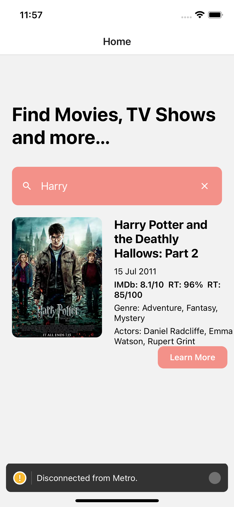
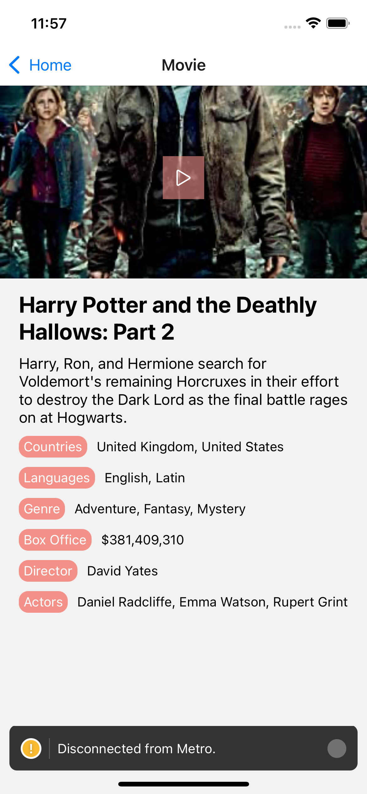

# Mio Health - Movie Challenge

## Home Screen

## Movie Screen

## Table of contents

- [Overview](#overview)
  - [The challenge](#the-challenge)
  - [Links](#links)
- [My process](#my-process)
  - [Built with](#built-with)
  - [What I learned](#what-i-learned)
- [Author](#author)

## Overview

### The challenge

Users should be able to:

- View the optimal layout for the site depending on their device's screen size
- Filter movies based on their titels

### Links

- Solution URL: https://github.com/milimyname/mili-search-movie-app.git
- Live Site URL: 

## My process

### Built with

- React Native
- React Native Navigation
- Redux

### What I learned

Tbh I've only used React Native for an understanding what it is and now I've created my first app. I was excited and worried about the fact I couldn't manage to do it. The design doesn't look like a real world project but I'll do it better.

## Author

- Twitter - https://twitter.com/milimyname
